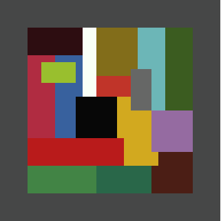
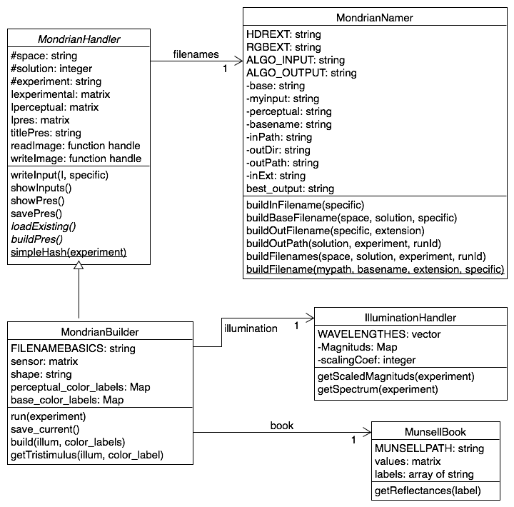

  
Part of an internship at the [Image processing for enhanced cinematography research group](http://ip4ec.upf.edu).

This README aims to explain how to use the code \([Quickstart](#quickstart)\), then how it works.

# Quickstart

## Installation

- If you have set up the whole Mondrians project (only available for [UPF - IP4EC members](http://ip4ec.upf.edu)), you could go to [Use](#use).

### Modules
Clone this remote and [personalized_tools](https://github.com/tourfl/personalized_tools), that you may store in the same directory.

```
git clone git@github.com:tourfl/mondrian_factory.git  
git clone git@github.com:tourfl/personalized_tools.git
```

### Toolboxes

Then you clone the [HDR Toolbox](https://github.com/banterle/HDR_Toolbox), on your local Matlab folder (assuming this is **~/Documents/MATLAB/**), with the following command:

```
git clone https://github.com/banterle/HDR_Toolbox.git ~/Documents/MATLAB/HDR_Toolbox
```

### Pathes
Next, you copy the **startup.m** file (:warning: **it assumes you have put the two repositories in your Matlab folder**) to your Matlab folder. It will automaticaly add the good folders to your Matlab path.

It is now installed! :camel:

## Use

All you need to modify is the **main.m** file. The parameters are the following:

- [space](#space): RGB, LMS or HDR
- [shape](#shape): Land
- [solution](#illumination): 1 to 5
- figs_on: true or false
- save_on: true or false

The output images are stored at **../images/** (same level as mondrian_factory/).



# Explanations

For more theoretical explanations, see the experimental report. This is only about how the code is working.

## Required modules & toolboxes

- **personalized\_tools**: shared classes and superclasses (e.g. MondrianHandler)
- **HDR\_Toolbox**: I/O on PFM images, required for using PFM images

## Folders

- **data**: mainly .mat files with color matching functions, shape description, munsell colors reflectances, illuminants powerness

## Parameters

### Space
Mainly refers to color space. For _LMS_, the cones fundamentals are used, and for _RGB_, an RGB color matching function. The data are from the [Colour & Vision database from the University College of London](http://www.cvrl.org).
Concerning the _HDR space_ this is the same color matching function as RGB but the images are saved as PFM images. This file format allow to work with RGB values that are out of the [0 1] range. Yet, this is mainly used because an algorithm (private) requires PFM as input.

### Shape
Currently there is only one shape available, this is the one from [Land and McCann's experiment](http://www.mccannimaging.com/Retinex/Publications_files/77LandSciAm.pdf).
You could build another shape (with the same number of areas), following the model of the existing one (data/shape/*Land*shape.mat, modify the italic part).

### Illumination
trying to emulate Land's illuminations, 5 attempts are available:

- To have best RGB white
- Land’s XYZ
- All Land’s illuminants powerness
- One of Land’s illuminants powerness
- D65 values

### Experiments
According to [Land's paper](http://www.mccannimaging.com/Retinex/Publications_files/77LandSciAm.pdf), there are 5 experiments: gray, red, green, blue, yellow. Those correspond to the actual color that is rendered as gray thanks to the illumination.

## Outputs

The output images would be stored in the **images/** folder, at the same level as mondrian_factory/.

```
..  
├── images  
│   ├── HDR  
│   │   ├── solution1  
│   │   │   ├── blueexp_s1_HDR.pfm  
│   │   │   ├── blueexp_s1_HDR_percepted.pfm  
│   │   │   ├── grayexp_s1_HDR.pfm  
│   │   │   ├── grayexp_s1_HDR_percepted.pfm  
│   │   │   ├── greenexp_s1_HDR.pfm  
│   │   │   ├── greenexp_s1_HDR_percepted.pfm  
│   │   │   ├── redexp_s1_HDR.pfm  
│   │   │   ├── redexp_s1_HDR_percepted.pfm  
│   │   │   ├── yellowexp_s1_HDR.pfm  
│   │   │   └── yellowexp_s1_HDR_percepted.pfm  
│   │   ├── solution2  
│   │   ├── ...  
│   ├── LMS  
│   └── RGB  
├── mondrian_factory  
└── personalized_tools  
```

For each experiment (blue, red,...), there is an experimental and a perceptual version, according to [McCann's paper](http://www.mcimg.us/Color/Color_Mondrians_files/76MMT%20VisRes.pdf).
The two versions are built in the following way:

- experimental: **actual** color labels & **experimental** illumination
- perceptual: **perceptual** color labels & **white** illumination

the color labels and illuminations, are from McCann's.

## Coding design

This is Matlab code in an object-oriented fashion. See the UML class diagram below.


